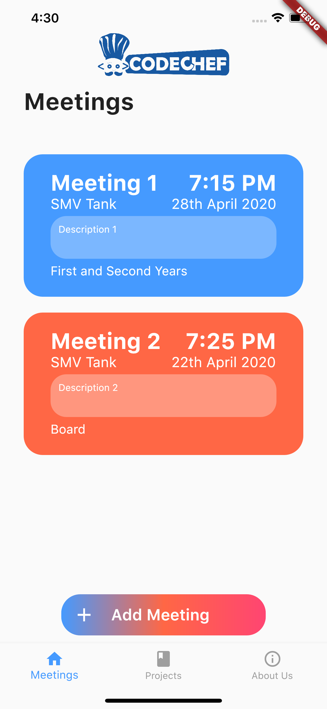
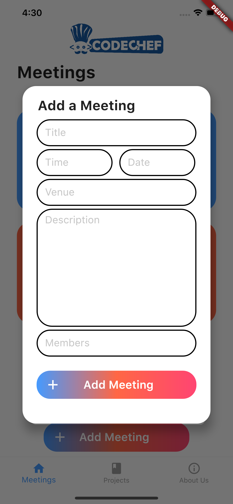
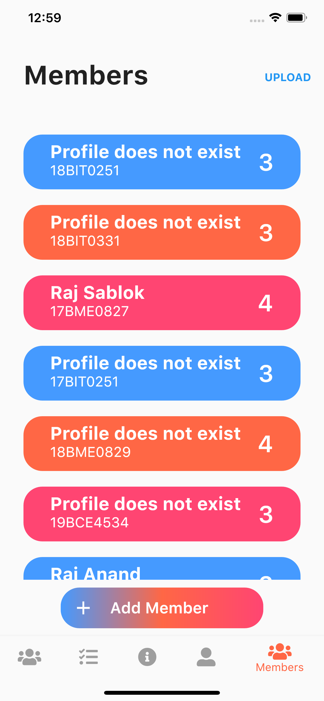

<p align="center"><a href="http://www.codechefvit.com" target="_blank"></a>
</p>

# CodeChef-VIT-App

> <Subtitle>
> An all in one app for every CodeChef-VIT member.

---
[](INSERT_LINK_FOR_DOCS_HERE) 
  [](INSERT_UI_LINK_HERE)


## Features
- Manage, View and Set meetings
- Discuss and Assign projects
- Attendance in one Tap
- An expenses page to keep track of club expenses for easy reimbursement
- An about us page


## Screenshots
<div class="row">
  <div class="column">
    
  </div>
  <div class="column">
    
  </div>
  <div class="column">
    
  </div>
  <div class="column">
    
  </div>
  <div class="column">
    
  </div>
</div>

## Instructions to run

```
Clone the Project

Instructions for Android:
- Go to CCApp//build/app/outputs/apk/release/app-release.apk
- Install APK on your Android device

Instructions for iOS:
- Open the project file in XCode
- Run the App to Install

```

## Contributors
- <a href="https://github.com/44t4nk1">Siddharth Singh</a>
- <a href="https://github.com/rvjain0510">Rishav Jain</a>
- <a href="https://github.com/DhananjayM">Dhananjay Murugesh</a>

## License

[](http://badges.mit-license.org)

<p align="center">
	With :heart: by <a href="http://www.codechefvit.com" target="_blank">CodeChef-VIT</a>
</p>
